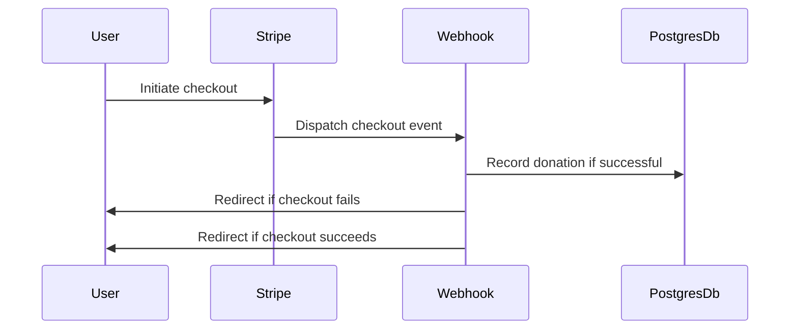

```mermaid
sequenceDiagram
    User->>Stripe: Initiate checkout
    Stripe->>Webhook: Dispatch checkout event
    Webhook->>PostgresDb: Record donation if successful
    Webhook->>User: Redirect if checkout fails
    Webhook->>User: Redirect if checkout succeeds
```